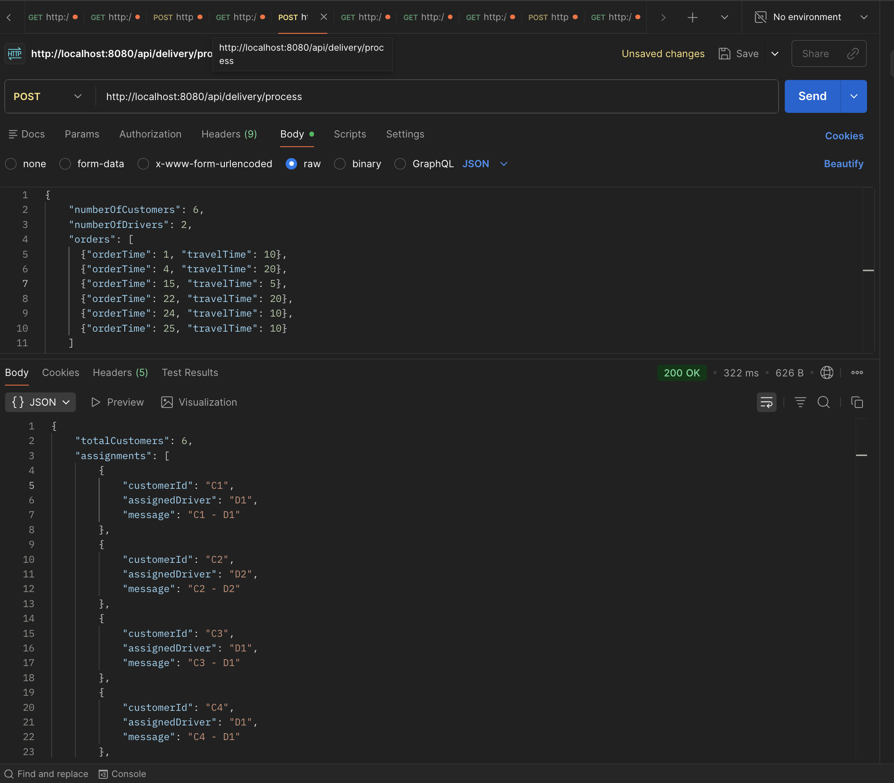
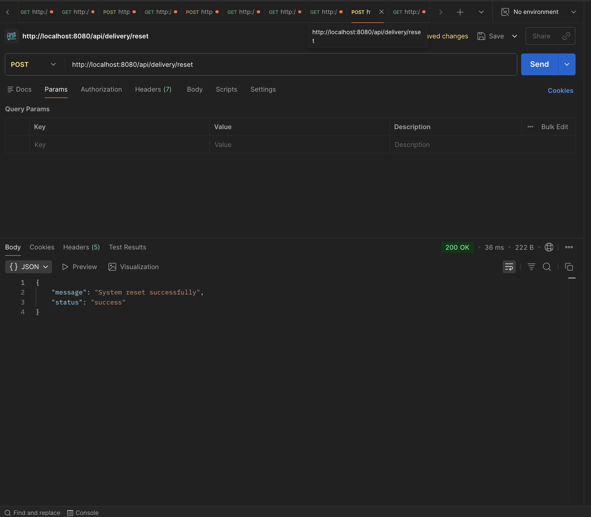

# RoofTop Food Delivery System

A Spring Boot REST API that assigns delivery drivers to customer orders based on availability and timing.

## Problem

Assign M drivers to N customer orders where:
- Each order has: order time (O) and travel time (T)
- Drivers are assigned by lowest index first (D1, then D2, etc.)
- Drivers can only handle one order at a time
- If all drivers are busy, return "No Food :-("

## Tech Stack

- Java 17
- Spring Boot 2.7.14
- Spring Data JPA
- H2 Database (in-memory)
- Maven

## Quick Start

### 1. Build
```bash
mvn clean install
```

### 2. Run
```bash
mvn spring-boot:run
```

### 3. Test
```bash
curl http://localhost:8080/api/delivery/health

curl -X POST http://localhost:8080/api/delivery/process \
  -H "Content-Type: application/json" \
  -d '{
    "numberOfCustomers": 6,
    "numberOfDrivers": 2,
    "orders": [
      {"orderTime": 1, "travelTime": 10},
      {"orderTime": 4, "travelTime": 20},
      {"orderTime": 15, "travelTime": 5},
      {"orderTime": 22, "travelTime": 20},
      {"orderTime": 24, "travelTime": 10},
      {"orderTime": 25, "travelTime": 10}
    ]
  }'
```

**Expected:** `C1-D1, C2-D2, C3-D1, C4-D1, C5-D2, C6-No Food :-(`

## API Endpoints

Base URL: `http://localhost:8080/api/delivery`

| Method | Endpoint | Description |
|--------|----------|-------------|
| POST | `/process` | Process orders and assign drivers |
| GET | `/drivers` | Get all drivers |
| GET | `/customers` | Get all customers |
| GET | `/assignments` | Get assignment history |
| POST | `/reset` | Clear all data |
| GET | `/health` | Health check |

## How It Works

The assignment logic uses a PriorityQueue to efficiently find available drivers:

1. Initialize drivers with `availableAt = 0`
2. Load drivers into a min-heap (sorted by availability time, then driver index)
3. For each order:
   - Check the driver at the top of the heap
   - If `availableAt <= orderTime`: assign them, update their time, re-insert
   - Otherwise: "No Food :-("

**Why PriorityQueue?** Instead of checking all M drivers for each order (O(N×M)), the heap gives us the next available driver in O(log M) time. For scale (think 1000 orders, 100 drivers), this cuts ~100K operations down to ~6.6K.

**Complexity:** O(N log M) time, O(M) space

### Example

Given 6 customers and 2 drivers:

| Customer | Order Time | Travel Time | D1 Free At | D2 Free At | Assigned |
|----------|-----------|-------------|------------|------------|----------|
| C1       | 1         | 10          | 0          | 0          | D1       |
| C2       | 4         | 20          | 11         | 0          | D2       |
| C3       | 15        | 5           | 11         | 24         | D1       |
| C4       | 22        | 20          | 20         | 24         | D1       |
| C5       | 24        | 10          | 42         | 24         | D2       |
| C6       | 25        | 10          | 42         | 34         | No Food  |

## Project Structure

```
food-delivery-system/
├── src/main/java/com/rooftop/delivery/
│   ├── FoodDeliveryApplication.java
│   ├── controller/DeliveryController.java
│   ├── service/DeliveryAssignmentService.java
│   ├── repository/
│   ├── model/
│   └── dto/
├── src/main/resources/application.properties
├── pom.xml
└── README.md
```

## Database

Uses H2 in-memory database by default. Access H2 console at:
- URL: http://localhost:8080/h2-console
- JDBC URL: `jdbc:h2:mem:rooftop_delivery`
- Username: `sa`
- Password: (empty)

### Tables

**drivers**: Tracks driver ID, status, and availability time  
**customers**: Stores customer orders and assignments  
**delivery_assignments**: Complete audit trail of assignments

## Optional: MySQL Setup

1. Install MySQL 8.0+
2. Create database: `CREATE DATABASE rooftop_delivery;`
3. Update `application.properties`:
   - Comment out H2 config
   - Uncomment MySQL config
   - Set your password

## Screenshots

### API Endpoints







## Input File Format

You can also use `input.txt`:
```
6,2          # N customers, M drivers
1,10         # orderTime, travelTime
4,20
15,5
22,20
24,10
25,10
```

## Testing Tools

**cURL**: See examples above  
**Postman**: Import endpoints, set base URL to `http://localhost:8080`  
**H2 Console**: Run SQL queries directly

For detailed technical documentation, see [DOCUMENTATION.md](DOCUMENTATION.md)
